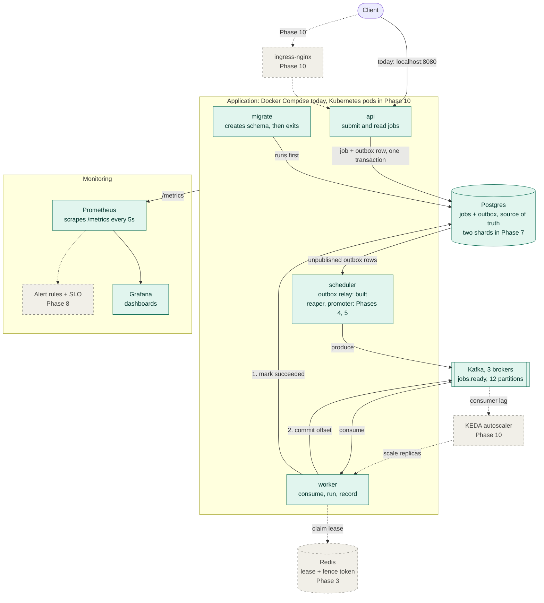

# Architecture

> **Current state: Phase 1 complete.** This file is updated whenever a phase lands, in the same
> branch as the code, so the diagram and the status table always match what is actually built.

## Diagram

**Legend.** Solid green boxes and solid arrows are built and running. Dashed gray boxes and dashed
arrows are planned, and each one names the phase that builds it. The full sequence is in
[plan.md](plan.md).

---

## How a job flows today

1. `migrate` runs once at startup, creates the `jobs` and `outbox` tables, and exits. Nothing
   else starts until it has finished.
2. A client sends `POST /jobs`. The `api` writes the job row and an outbox row in one Postgres
   transaction, then replies `202 Accepted`.
3. The `scheduler`'s relay loop finds outbox rows not yet published, produces each one to the
   Kafka topic `jobs.ready`, and only then marks the row published.
4. A `worker` consumes the message, runs the job (a no-op until Phase 6), and marks it
   `succeeded` in Postgres.
5. Only after that write does the worker commit its Kafka offset. A crash between the two means
   the job is delivered again, never lost.

Every arrow that crosses a system boundary is ordered so that a crash produces a rerun rather
than a loss. [failure-modes.md](failure-modes.md) walks through each crash point.

---

## Component status

| Component | Role | Status | Phase |
|---|---|---|---|
| `api` | Accepts jobs (`POST /jobs`) and reports them (`GET /jobs/{id}`) | Built | 1 |
| `migrate` | Creates the schema once, before anything else starts | Built | 1 |
| `scheduler`: outbox relay | Moves outbox rows into Kafka | Built | 1 |
| `scheduler`: lease reaper | Requeues jobs whose worker stopped heartbeating | Planned | 4 |
| `scheduler`: due-job promoter | Releases delayed jobs when their time arrives | Planned | 5 |
| `worker` | Consumes, runs, records the result, commits the offset | Built, without a lease | 1 |
| Lease and fence token | Stops two workers recording the same job | Planned | 3 |
| Postgres | Jobs and outbox; the only source of truth | Built, one instance | 1 |
| Postgres sharding | Two shards, routed by job id or idempotency key | Planned | 7 |
| Kafka | Three brokers, `jobs.ready` with 12 partitions, replication factor 3 | Built | 0 |
| `jobs.dlq` topic | Jobs that exhausted their retries | Created, unused | 6 |
| Redis | Leases and the fence counter | Running, unused | 3 |
| Prometheus and Grafana | Scrape `/metrics`, draw the dashboard | Built, three job metrics | 0, 1 |
| Full metric set, alert rules, SLO | Say when the system is breaking its promise | Planned | 8 |
| Load and chaos tests | Measure throughput; kill brokers, Redis, a shard | Planned | 9 |
| Kubernetes, ingress-nginx, KEDA | Pods, an entry point, autoscaling on consumer lag | Planned | 10 |

---

## Where it runs

**Today: Docker Compose.** Each program runs in its own container, built from the same
`Dockerfile`. `make up` starts everything in dependency order, `make scale N=3` runs three
workers, and Prometheus finds every worker replica through Docker's DNS.

**Phase 10: Kubernetes.** The same containers run as pods on a three-node `kind` cluster.
`ingress-nginx` becomes the entry point in front of `api`, and KEDA adds or removes worker pods
based on Kafka consumer lag. The scheduler stays at exactly one replica, since its loops must not
run twice.

---

## Who owns what

| System | Owns | If you wipe it |
|---|---|---|
| Postgres | Every job and its state; the outbox | Work is lost. This is the one that matters. |
| Kafka | Delivering jobs to workers | Replay from the outbox in Postgres |
| Redis (Phase 3) | Who holds each job right now, and the fence counter | Brief slowdown, no loss |

The reasoning behind each choice is in [design-decisions.md](design-decisions.md).

---

## Keeping this file current

Every phase branch updates this file before it merges: switch the finished parts from `planned` to
`done` in the diagram, update the status table, and change the current-state line at the top.
A phase is not finished until this file says it is.
